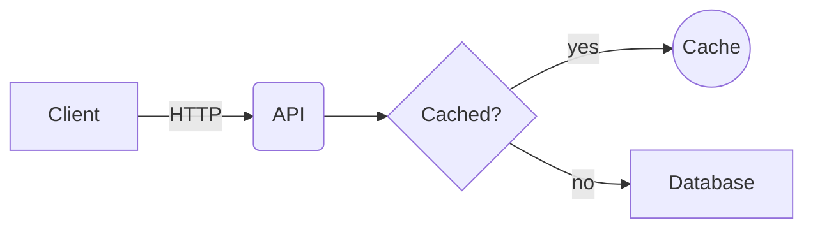
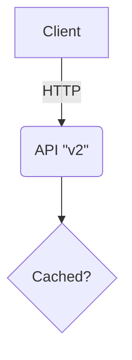

# Diagrammer

Diagrammer is a VS Code extension that allows users and AI to create quick diagrams for coding.
Diagrams are stored as plain JSON (`*.diagram.json`) files right next to your code, so they can be
reviewed, diffed and versioned like any other file.

## Features

- **Custom diagram editor** – any file ending in `.diagram.json` opens in a visual canvas
  (use *Reopen Editor With… → Text Editor* to see the raw JSON).
- **`Diagrammer: New Diagram` command** – creates `untitled.diagram.json` in the first workspace
  folder (`untitled-1.diagram.json`, `untitled-2.diagram.json`, … if the name is taken) and opens
  it. Without an open folder you are asked where to save the file.
- **Shape palette** – rectangle, rounded rectangle, ellipse, diamond, text label and sticky note.
  Drag a shape onto the canvas, or click it to drop it in the middle of the visible area.
- **Move** – drag a node to move it. Connectors stay attached and re-route to the shape outline.
- **Labels** – double-click a node or connector (or select it and press `Enter`/`F2`) to edit its
  label. `Enter` saves, `Shift+Enter` inserts a line break, `Escape` cancels.
- **Connectors** – hover a node to reveal its four handles, then drag from a handle onto another
  node to connect them. Connectors are directed (`from` → `to`) and drawn with an arrow head.
- **Delete** – click a node or connector to select it and press `Delete` (or `Backspace`).
  Deleting a node also deletes every connector attached to it.
- **Auto layout** – arrange the whole diagram automatically with [dagre](https://github.com/dagrejs/dagre)
  (see [Auto layout](#auto-layout) below), from the toolbar button or the Command Palette. Nodes
  written without coordinates are placed automatically when the file is opened.
- **Edit Diagram with AI** – describe a change in plain language; a VS Code language model
  (e.g. GitHub Copilot) turns it into validated edit operations, you review a summary, and only then
  is it applied as one undoable edit. Agents can call `diagrammer.applyOperations` directly. See
  [AI editing](#ai-editing).
- **Mermaid import and export** – turn a Mermaid `flowchart` from a README or a `.mmd` file into a
  laid-out diagram, or copy/export a diagram as Mermaid. See [Mermaid](#mermaid).
- **VS Code integration** – edits mark the file dirty, `Ctrl+S`/`Cmd+S` saves, and
  `Ctrl+Z`/`Ctrl+Y` (or `Cmd+Z`/`Cmd+Shift+Z`) undo and redo through VS Code's edit history. Hot
  exit/backups, *Save As* and *Revert File* are supported. Colours follow the active VS Code theme.
- **Safe with bad files** – a file that is not valid JSON or does not match the format below is
  shown with an error message instead of the canvas and is never overwritten.

## Auto layout

Auto layout arranges nodes in layers along the direction of their connectors, keeps nodes from
overlapping and tries to minimise connector crossings.

| Mode | Description |
| --- | --- |
| `top-to-bottom` (default) | Hierarchical layout; connectors point downwards. |
| `left-to-right` | Hierarchical layout; connectors point to the right. |

Cycles and disconnected groups of nodes are supported. Only the `x`/`y` of nodes change: ids,
labels, types, sizes and connectors stay as they are.

- **Toolbar button** – *Auto layout* at the bottom of the shape palette applies the default
  (`top-to-bottom`) layout to the open diagram.
- **Commands** (Command Palette, while a diagram editor is active):

  | Command | ID | Mode |
  | --- | --- | --- |
  | `Diagrammer: Auto Layout` | `diagrammer.autoLayout` | default (`top-to-bottom`) |
  | `Diagrammer: Auto Layout Top to Bottom` | `diagrammer.autoLayoutTopToBottom` | `top-to-bottom` |
  | `Diagrammer: Auto Layout Left to Right` | `diagrammer.autoLayoutLeftToRight` | `left-to-right` |

  Each command lays out the diagram in the active Diagrammer editor. When called through
  `vscode.commands.executeCommand` you can pass the `Uri` of an open diagram as the first argument
  to target it explicitly; the command returns `true` if any node moved.
- **Undo and save** – a layout is a normal edit: the file becomes dirty, `Ctrl+Z` undoes it and
  saving writes the new positions into the same JSON format. Reopening the saved file shows the
  same positions; a diagram whose nodes all have coordinates is never re-arranged automatically.
- **Nodes without coordinates** – when a file is opened and some nodes have no `x`/`y`:
  - if no node has coordinates, the whole diagram is laid out;
  - otherwise only the nodes without coordinates are laid out, as a block placed below the existing
    nodes, so nothing that already has a position moves and nothing overlaps.

  This placement is applied as an edit too, so the file is marked dirty until you save it.
- **Selection** – the editor currently supports selecting a single node only, so auto layout
  always applies to the whole diagram. (The layout engine already supports laying out a subset
  of nodes, keeping its top-left corner in place.)

### AI workflow

Tools and AI agents don't need to calculate positions. Write nodes and connectors without `x`/`y`
(and, optionally, without `width`/`height`, which then default to the shape's standard size):

```json
{
  "version": 1,
  "nodes": [
    { "id": "client", "type": "rectangle", "label": "Client" },
    { "id": "api", "type": "ellipse", "label": "API" },
    { "id": "db", "type": "rectangle", "label": "Database" }
  ],
  "edges": [
    { "id": "e1", "from": "client", "to": "api", "label": "HTTP" },
    { "id": "e2", "from": "api", "to": "db" }
  ]
}
```

Then open the file in VS Code (the nodes are placed automatically) and save it, or run
`Diagrammer: Auto Layout` to re-arrange a diagram after adding nodes. To add nodes to an existing
diagram, append them without coordinates: they are placed below the existing nodes when the file
is opened.

The layout engine (`src/layout/index.ts`) is plain TypeScript with no VS Code dependency, so a
script or a future CLI/MCP tool can call `computeLayout`, `autoLayout` or `placeUnpositioned`
directly.

## AI editing

- **`Diagrammer: Edit Diagram with AI`** (`diagrammer.editWithAI`, while a Diagrammer editor is
  active) asks for an instruction, sends the diagram, the selected node and the operation schema to
  the first chat model available through the VS Code Language Model API, validates the returned
  operations and shows a summary (*Add 1 node: "Cache"*, *Rename "API" → "Public API"*, …) with
  **Apply (keep positions)**, **Apply and Re-layout** and **Cancel**. Invalid model output is
  reported and never changes the diagram. No API keys are needed or stored; you need an extension
  that provides chat models, such as GitHub Copilot Chat.
- **`diagrammer.applyOperations`** – `executeCommand('diagrammer.applyOperations', uri?, operations)`
  validates and applies a batch of operations without any model call or UI and returns
  `{ summary, idMap }` or `{ errors }`.

Operations (`addNode`, `removeNode`, `renameNode`, `moveNode`, `addConnector`, `removeConnector`,
`updateNodeMetadata`, `updateConnectorMetadata`, `applyLayout`), the id/tempId rules and the JSON
Schema are documented in [docs/operations.md](docs/operations.md). Batches are atomic and applied
through the normal edit path, so undo and saving work as usual.

## Mermaid

Diagrammer can import and export [Mermaid](https://mermaid.js.org/) flowcharts, so diagrams can move
between the visual editor and Markdown docs. Parsing is done by a small built-in parser
(`src/mermaid/parse.ts`); the `mermaid` package is not used.

| Command | ID | What it does |
| --- | --- | --- |
| `Diagrammer: Import Mermaid from Text` | `diagrammer.importMermaidFromText` | Imports the selection in the active text editor, or its whole content if nothing is selected. Without a text editor it opens an empty untitled document to paste into; run the command again afterwards. |
| `Diagrammer: Import Mermaid File` | `diagrammer.importMermaidFile` | Picks a `.mmd` / `.mermaid` file and imports it. |
| `Diagrammer: Copy as Mermaid` | `diagrammer.copyAsMermaid` | Copies the active diagram as Mermaid text to the clipboard. |
| `Diagrammer: Export Mermaid File` | `diagrammer.exportMermaidFile` | Saves the active diagram as a `.mmd` file. |

### Import

An import always creates a **new** diagram file and opens it; it never changes an open diagram.
The file is named after the source (`flow.mmd` → `flow.diagram.json`, next to it; text from an
unsaved editor → `mermaid-import.diagram.json` in the first workspace folder) and gets a `-1`,
`-2`, … suffix instead of overwriting an existing file. Nodes are placed with
[auto layout](#auto-layout) in rank order along the Mermaid direction (`TD`/`TB` downwards, `BT`
upwards, `LR` to the right, `RL` to the left), without overlaps.



imports as five nodes (rectangle, rounded rectangle, diamond, ellipse, rectangle) and four
connectors labelled `HTTP`, (none), `yes` and `no`, laid out left to right.

**Supported syntax**

- Header: `flowchart` or `graph`, optionally followed by `TD`, `TB`, `BT`, `LR` or `RL` (default `TD`).
- Nodes: `A`, `A[label]`, `A(label)`, `A{label}`, `A((label))`, and quoted labels such as
  `A["label"]`. A node without a label uses its id as label.
- Shapes: `[ ]` → rectangle, `( )` → rounded rectangle, `{ }` → diamond, `(( ))` → ellipse
  (drawn as a circle). Other Mermaid shapes (`[( )]`, `{{ }}`, `([ ])`, …) import as rectangles
  with a warning.
- Edges: `-->`, `---`, `-.->` and `==>` (and longer variants such as `--->`). Diagrammer
  connectors have a single style, so dotted, thick and arrow-less edges import as normal
  connectors; their direction (source → target) is kept.
- Edge labels: `A -->|text| B`, `A -->|"text"| B` and `A -- text --> B` (also `-. text .->` and
  `== text ==>`).
- Chains: `A --> B --> C`.
- Several statements on one line separated by `;`.
- `%%` comment lines (including `%%{init: …}%%` directives) and a leading `---` front-matter block.
- Entity codes in labels (`#quot;`, `#35;`, …) and `<br>` line breaks.

**Unsupported constructs** are skipped and reported as warnings with their 1-based line number
(shown after the import; *Show Warnings* opens the full list in the *Diagrammer* output channel):

- `subgraph` … `end` (the nodes and edges inside a subgraph are still imported),
- `classDef`, `class` and the `:::class` shorthand,
- `style` and `linkStyle`,
- `click`,
- `direction` inside subgraphs,
- any other statement the parser does not understand (for example `A --> B & C`).

Input that is not a flowchart – e.g. `sequenceDiagram` or `classDiagram`, or text whose first
non-comment line is not `flowchart`/`graph` – is rejected with an error and no file is created.

### Export



- The output starts with `flowchart TD`, followed by one line per node and then one line per
  connector, each indented by four spaces. Positions and sizes are not exported.
- Node ids are reduced to `[A-Za-z0-9_]` (`node-1` → `node_1`); ids that collide afterwards get a
  numeric suffix (`node_1_2`), and Mermaid keywords such as `end` get a `_` suffix.
- Labels are always quoted. `"` is written as `#quot;` (and a `#` that would read as an entity as
  `#35;`), line breaks as `<br>`; brackets and pipes are safe inside the quotes.
- Shapes use the inverse of the import mapping: rectangle `[ ]`, rounded rectangle `( )`,
  diamond `{ }`, ellipse `(( ))`; text and sticky notes become rectangles.
- Without an active Diagrammer editor the export commands show an error.

When called through `vscode.commands.executeCommand`, `importMermaidFile` accepts the `Uri` of the
file to import, and `copyAsMermaid` / `exportMermaidFile` accept the `Uri` of an open diagram
(`exportMermaidFile` also takes the target `Uri` as a second argument, skipping the save dialog).
The commands return the created `Uri` or the Mermaid text, or `undefined` if nothing happened.

## File format

```json
{
  "version": 1,
  "nodes": [
    { "id": "node-1", "type": "rectangle", "x": 40, "y": 40, "width": 140, "height": 70, "label": "Client" },
    { "id": "node-2", "type": "ellipse", "x": 300, "y": 40, "width": 140, "height": 80, "label": "API" }
  ],
  "edges": [
    { "id": "edge-1", "from": "node-1", "to": "node-2", "label": "HTTP" }
  ]
}
```

| Field | Description |
| --- | --- |
| `version` | Format version. Currently always `1`; files with a newer version are rejected. |
| `nodes[].id` | Unique, non-empty string. |
| `nodes[].type` | One of `rectangle`, `roundedRectangle`, `ellipse`, `diamond`, `text`, `sticky`. |
| `nodes[].x`, `nodes[].y` | Top-left corner in canvas pixels. Optional: nodes without them are placed by [auto layout](#auto-layout) when the file is opened. |
| `nodes[].width`, `nodes[].height` | Size in canvas pixels. Optional: defaults to the shape's standard size. |
| `nodes[].label` | Text shown in the shape; may contain `\n` line breaks. |
| `edges[].id` | Unique, non-empty string. |
| `edges[].from`, `edges[].to` | Ids of the source and target nodes. |
| `edges[].label` | Optional connector label (omitted when empty). |

When loading, an empty file is treated as an empty diagram, missing positions and sizes are filled
in as described above, unknown extra properties are ignored
and edges whose `from`/`to` point to missing nodes are dropped. Anything else that does not match
the format (invalid JSON, wrong types, unknown node types, duplicate ids) is reported as an error.

## Running the extension

Requirements: Node.js 20.19+ (or 22.13+) and VS Code 1.90+.

```bash
npm install
npm run compile      # type-check and bundle into dist/ with esbuild
```

Then open this folder in VS Code and press `F5` (*Run Extension*) to start an Extension
Development Host. In it, run **Diagrammer: New Diagram** from the Command Palette or open any
`*.diagram.json` file. `npm run watch` rebuilds automatically while you edit.

## Development

| Script | Purpose |
| --- | --- |
| `npm run compile` | Type-check (`tsc --noEmit`) and bundle the extension and webview with esbuild. |
| `npm run watch` | Rebuild on change. |
| `npm run lint` | Run ESLint (typescript-eslint) over `src/`. |
| `npm test` | Compile and run the unit tests with Mocha (model, layout engine, AI operations and edit flow, Mermaid import/export, webview canvas in jsdom). |
| `npm run test:integration` | Launch VS Code via `@vscode/test-electron` and run the end-to-end tests. Downloads VS Code on first run; on Linux CI wrap it in `xvfb-run -a`. |
| `npm run package` | Production (minified) bundle. |

Project layout:

- `src/extension.ts` – activation; registers the editor and the commands.
- `src/diagramEditor.ts` – `CustomEditorProvider`, document model, save/revert/backup, undo/redo.
- `src/newDiagram.ts` – the `Diagrammer: New Diagram` command.
- `src/layout/index.ts` – pure auto-layout engine (dagre), usable without VS Code.
- `src/mermaid/` – Mermaid support: `parse.ts` (pure flowchart parser), `convert.ts` (pure
  Mermaid ↔ diagram conversion and layout) and `commands.ts` (the import/export commands).
- `src/ai/` – AI editing: `operations.ts` (pure operation schema, validator and `applyOperations`),
  `prompt.ts`, `editSession.ts` (the confirm-before-apply flow), `provider.ts`
  (`DiagramAIProvider`), `vscodeLmProvider.ts` (`vscode.lm`) and `commands.ts`.
- `src/model/diagram.ts` – pure diagram model: parsing/validation, serialization, edits, geometry.
  Shared by the extension host and the webview.
- `src/webview/main.ts`, `media/diagram.css` – the SVG canvas (no third-party diagram library;
  layout runs in the extension host).
- `src/protocol.ts` – messages exchanged between the extension host and the webview.
- `src/test/unit` – Mocha unit tests; `src/test/integration` – VS Code integration tests.
